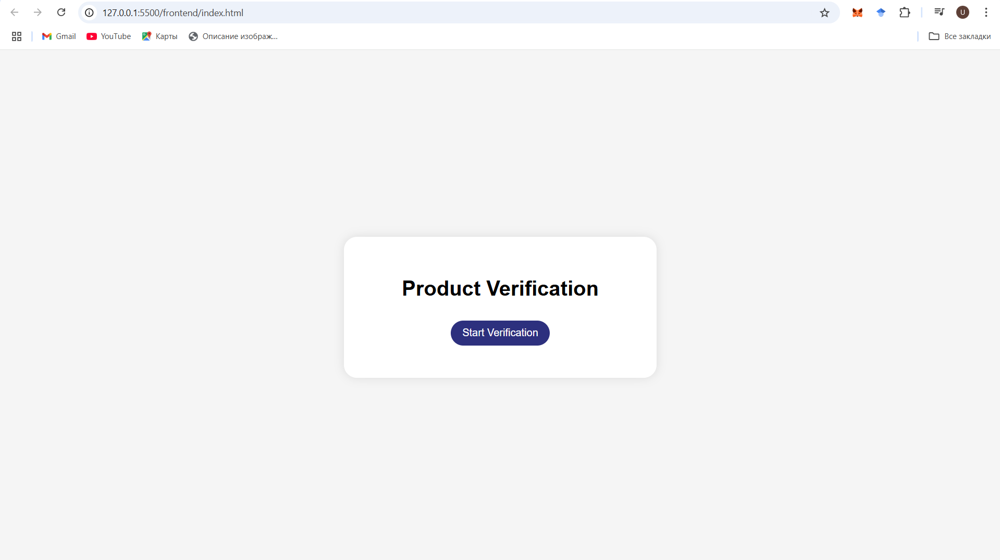
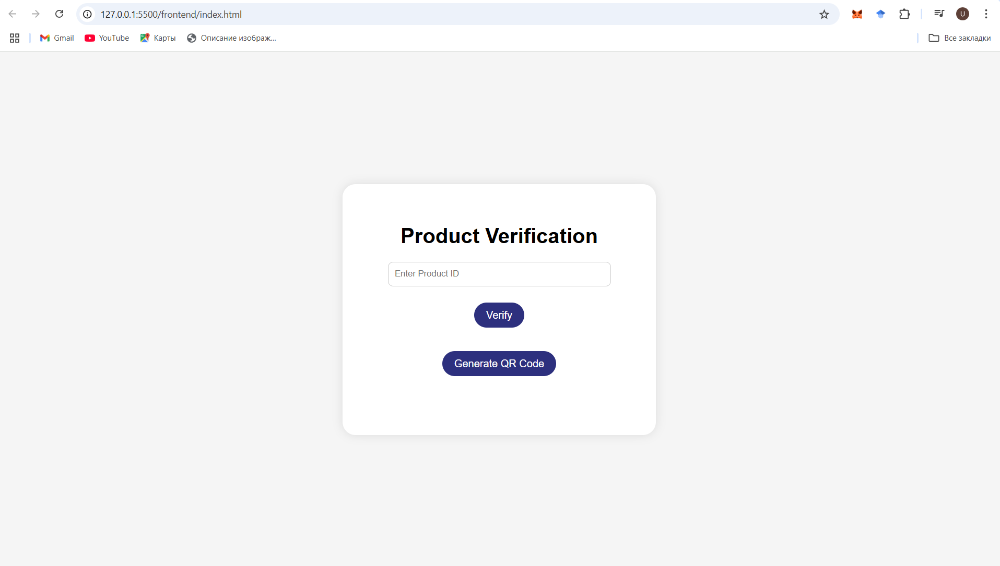
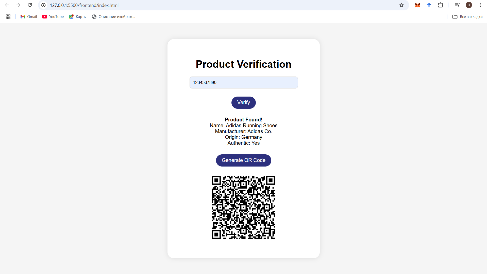

#  Fake Product Identification System  
**Ulzhan Tamyzgazina — SE-2325**

##  Screenshots

### Main Interface  

### Product Verified with QR Code  

##  Description

This web-based project helps users verify the authenticity of a product using a product ID and QR code. It simulates how a real-world blockchain-powered verification system might work, where products have QR codes embedded that direct users to verify data stored on a secure backend.

Users can:
- Enter a product ID to check its authenticity.
- Generate a QR code that links to the verification page.
- Scan the QR code to quickly verify using a mobile device.

## Technologies Used
- HTML5, CSS3, JavaScript
- QRCode.js (via CDN)
- JSON (as fake blockchain data)
- Visual Studio Code + Live Server

